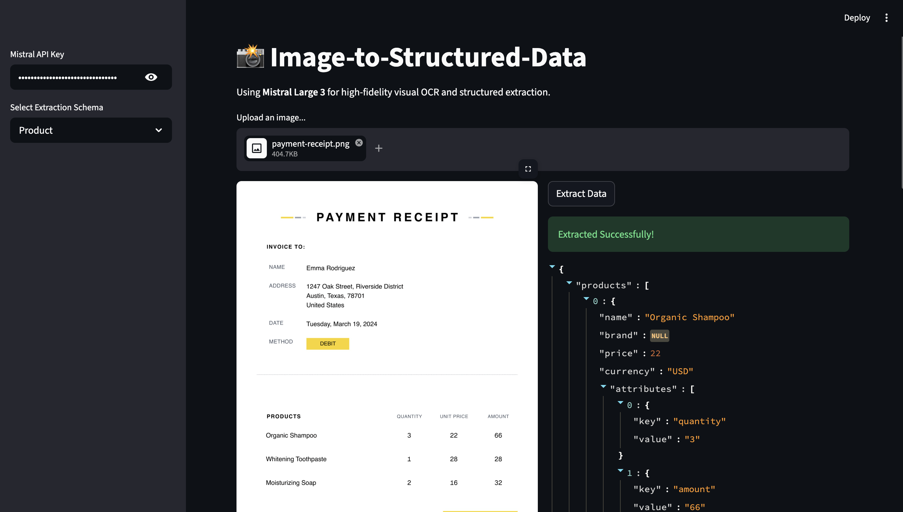

# Image-to-Structured-Data Extractor (Mistral Large 3 + Instructor)

A high-fidelity, visual extraction framework that converts images into validated, structured JSON using Mistral Large 3 and Pydantic.

## Demo



## Overview

This project demonstrates how to move beyond raw text OCR to **Structured Visual Extraction**. Instead of getting a messy block of text, this tool uses the `instructor` library to force the VLM (Vision Language Model) to output data that fits a strict Pydantic schema. 

**Problem it solves:** Traditionally, extracting specific fields from varying layouts (like different receipt formats or product labels) required complex regex or custom OCR training. This project solves that by using Mistral's flagship multimodal model to "understand" the visual context and map it directly to code-ready objects.

**Who is this for:** AI Engineers building automated data entry pipelines, invoice processing systems, or cataloging tools.

## Features

- **Schema-First Extraction:** Define your desired output in Python (Pydantic), and the model follows it.
- **Flagship Multimodal Model:** Uses Mistral Large 3 (`mistral-large-latest`) for state-of-the-art visual reasoning.
- **Parallel Extraction:** Capable of extracting multiple items (e.g., all products on a receipt) in a single pass using Pydantic Collections.
- **Auto-Image Optimization:** Intelligent resizing and compression to handle high-res photos while ensuring the model sees the sharpest possible text.
- **Multimodal Validation:** Leverages `instructor` to ensure the JSON output is valid and matches the schema before returning.

## Tech Stack

**Frameworks & Libraries:**
- **Instructor:** For structured data extraction and validation.
- **Mistral Python SDK:** For multimodal inference.
- **Pydantic v2:** For defining data schemas.
- **Pillow (PIL):** For image processing and resizing.

**Additional Tools:**
- **Model:** `mistral-large-latest` (Mistral Large 3)
- **Web Framework:** Streamlit (UI)
- **Environment Management:** python-dotenv

## Prerequisites

Before you begin, ensure you have:

- Python 3.10 or higher (Recommended)
- API keys for:
  - [Mistral AI Console](https://console.mistral.ai/)
- Basic understanding of Pydantic and Multimodal LLMs.

## Installation

### 1. Clone the Repository

```bash
git clone https://github.com/Sumanth077/Hands-On-AI-Engineering.git
cd Hands-On-AI-Engineering/OCR/image_to_structured_data
```

### 2. Create Virtual Environment

```bash
python -m venv venv
source venv/bin/activate  # On Windows: venv\Scripts\activate
```

### 3. Install Dependencies

```bash
pip install -r requirements.txt
```

### 4. Set Up Environment Variables

Create a `.env` file in the project directory:

```bash
cp .env.example .env
```

Edit `.env` and add your **Mistral API key**:
```bash
MISTRAL_API_KEY=your_key_here
```

## Usage

### Running the Application

```bash
streamlit run app.py
```

### Example Extraction

**Input:**


**Output (Structured JSON):**
```json
{
  "products": [
    {
      "name": "Organic Shampoo",
      "brand": null,
      "price": 22.0,
      "currency": "USD",
      "attributes": [{"key": "Quantity", "value": "3"}],
      "summary": "Personal care product"
    },
    {
      "name": "Whitening Toothpaste",
      "brand": null,
      "price": 28.0,
      "currency": "USD",
      "attributes": [{"key": "Quantity", "value": "1"}],
      "summary": "Dental care product"
    }
  ]
}
```

## Project Structure

```
image_to_structured_data/
├── app.py                 # Streamlit UI Layer
├── processor.py           # Logic for image resizing & Mistral + Instructor calls
├── schemas.py             # Pydantic models (Includes Collection wrappers)
├── requirements.txt       # Dependencies
├── .env.example           # Environment template
└── README.md              # This file
```

## How It Works

1. **Pre-processing:** The system accepts an image and uses Pillow to check its resolution. It resizes the image to a maximum of 2048px (maintaining aspect ratio) to stay within optimal processing limits while keeping text sharp.

2. **Instructor Integration:** It wraps the Mistral AI client with `instructor`, allowing the model to target a specific `response_model` via Mistral's native tool-calling capability.

3. **Structured Prompting:** The image is sent as a base64 encoded string to Mistral Large 3. By using "Collection" models (e.g., `ProductCollection`), the model is instructed to find *every* instance of a product and return them as a list.

4. **Validation:** Pydantic validates the JSON returned. If Mistral hallucinates a field type (e.g., a string where a float should be), Instructor can catch this during the validation phase.

[⬆ Back to Top](#image-to-structured-data-extractor-mistral-large-3--instructor)