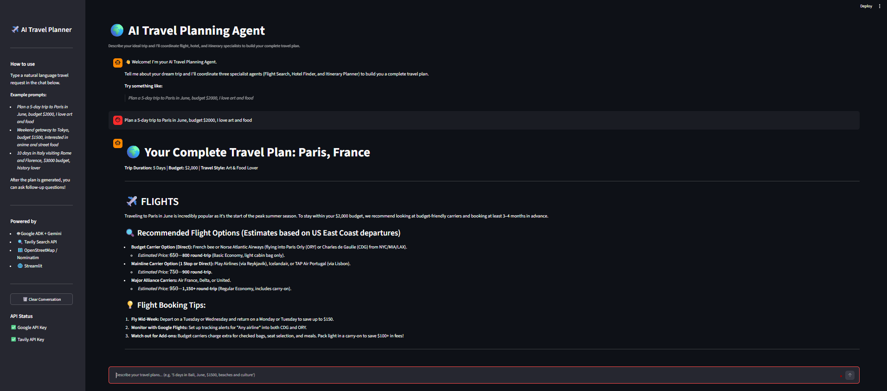

<a id="top"></a>
# AI Travel Planning Agent

> Multi-agent travel planner that turns a single natural language request into a complete trip plan with flights, hotels, and a day-by-day itinerary.

## Demo



## Overview

The AI Travel Planning Agent uses a root Google ADK agent to coordinate three specialist sub-agents: a Flight Agent, a Hotel Agent, and an Itinerary Agent. Each sub-agent independently searches the web in real time, and the root agent combines their results into one cohesive travel plan. Users interact through a Streamlit chat interface and can ask follow-up questions within the same conversational session.

## Features

- Natural language trip planning in a conversational chat UI
- Parallel specialist agents for flights, hotels, and itineraries
- Real-time web search via Tavily on every query
- Nearby place discovery using OpenStreetMap/Nominatim (no extra API key)
- Multi-turn conversation, so you can ask follow-ups after the initial plan

## Tech Stack

| Layer | Technology |
|---|---|
| Agent framework | Google ADK (`google-adk`) |
| LLM | Gemini 3.5 Flash (`gemini-3.5-flash`) |
| Web search | Tavily Search API |
| Location data | geopy + Nominatim (OpenStreetMap) |
| UI | Streamlit |

## Prerequisites

- Python 3.10 or higher
- A [Google AI Studio](https://aistudio.google.com/app/apikey) API key
- A [Tavily](https://app.tavily.com) API key

## Installation

**1. Clone the repository**

```bash
git clone https://github.com/Sumanth077/Hands-On-AI-Engineering.git
cd Hands-On-AI-Engineering/ai_agents/ai_travel_planning_agent
```

**2. Create and activate a virtual environment**

macOS / Linux:
```bash
python -m venv venv
source venv/bin/activate
```

Windows:
```bash
python -m venv venv
venv\Scripts\activate
```

**3. Install dependencies**

```bash
pip install -r requirements.txt
```

**4. Configure environment variables**

```bash
cp .env.example .env
```

Open `.env` and fill in your API keys (see [Environment Variables](#environment-variables)).

## Usage

```bash
streamlit run app.py
```

Open the URL shown in your terminal (usually `http://localhost:8501`).

**Example request:**

> *Plan a 5-day trip to Paris in June, budget $2000, I love art and food*

**What you get back:**

- Suggested outbound and return flights with estimated prices
- Hotel recommendations near key attractions with nightly rates
- A day-by-day itinerary with activities, restaurants, and travel tips

After the plan is generated, you can refine it conversationally:

> *Can you swap the Day 3 museum visit for something outdoors?*

## Environment Variables

Create a `.env` file in the project root with the following keys:

| Variable | Description | Where to get it |
|---|---|---|
| `GOOGLE_API_KEY` | Authenticates requests to Gemini via Google AI Studio | [aistudio.google.com/app/apikey](https://aistudio.google.com/app/apikey) |
| `TAVILY_API_KEY` | Enables real-time web search through Tavily | [app.tavily.com](https://app.tavily.com) |

```env
GOOGLE_API_KEY=your_google_api_key_here
TAVILY_API_KEY=your_tavily_api_key_here
```

## Project Structure

```text
ai-travel-planning-agent/
├── app.py              # Streamlit UI and ADK session management
├── agents.py           # Root agent and three specialist sub-agents
├── tools.py            # Tavily search and Nominatim location tools
├── requirements.txt    # Python dependencies
├── .env.example        # Environment variable template
├── .env                # Your local API keys (git-ignored)
└── assets/
    └── demo.png         # Demo screenshot
```

[Back to top](#top)
