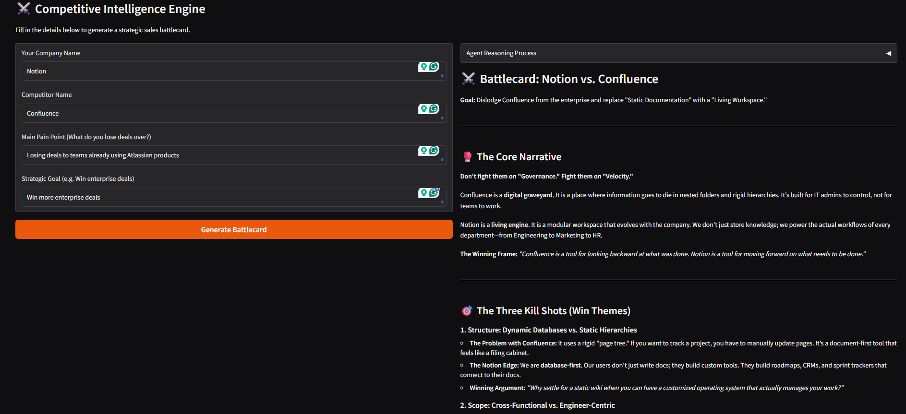

# Competitive Intelligence Agent

> Generate strategic sales battlecards by analyzing competitors through the unique lens of your own business context.

A multi-agent AI system that generates strategic sales battlecards by analyzing competitors through the unique lens of your own business context.

## Demo



## Overview

The **Competitive Intelligence Agent** solves the "generic research" problem by moving away from broad, impersonal reports. Instead of searching the web for everything about a competitor, this system uses specialized AI agents to analyze a competitor specifically in relation to *your* company's value proposition, your customers' specific pain points, and your strategic sales goals.

It uses **CrewAI** to orchestrate three specialized agents that research, compare, and synthesize actionable sales intelligence: a Market Scout, a Product Strategist, and a Battlecard Author.

This tool is designed for:
- **Sales Teams:** Who need immediate, punchy arguments to win against specific competitors.
- **Product Managers:** Who need to understand technical feature gaps vs. rivals.
- **Founders:** Who need to quickly validate their positioning in a crowded market.

## Features

- **Context-Aware Research:** Agents don't just search; they filter data based on your specific business pain points.
- **Real-time Reasoning Logs:** Transparency in the UI shows the agent’s internal "thought process" and research steps.
- **No-Jargon Battlecards:** Specialized synthesis agent trained to write punchy, founder-to-founder sales arguments rather than robotic reports.
- **Structured UI:** Form-based Gradio interface for clean, professional input and side-by-side analysis.

## Tech Stack

**Frameworks & Libraries:**
- **CrewAI:** Multi-agent orchestration.
- **Gemma 4-26B (via Gemini API/LiteLLM):** Advanced reasoning LLM.
- **Gradio:** Interactive web-based user interface.
- **LiteLLM:** Fallback adapter for broad model support.

**Additional Tools:**
- **Tavily Search API:** Real-time, AI-optimized web research.
- **dotenv:** Environment variable management.
- **uv:** Modern, high-speed Python dependency management.

## Prerequisites

Before you begin, ensure you have:

- Python 3.12 or higher
- [uv](https://github.com/astral-sh/uv) (Recommended for dependency management)
- API keys for:
  - [Google AI Studio](https://aistudio.google.com) for Gemini/Gemma (free tier available)
  - [Tavily Search API](https://tavily.com) (free tier available)

## Installation

### 1. Clone the Repository

```bash
git clone https://github.com/Sumanth077/Hands-On-AI-Engineering.git
cd Hands-On-AI-Engineering/ai_agents/competitive_intelligence_agent
```

### 2. Set Up Environment Variables

We use an `.env.example` file to manage configuration. Copy it to create your local `.env` file:

```bash
cp .env.example .env
```

Open the newly created `.env` file and insert your API keys:

```bash
GEMINI_API_KEY=your_gemini_api_key_here
TAVILY_API_KEY=tvly-your_tavily_key_here
```

### 3. Sync Environment

Since the project uses `uv` for dependency management, synchronize your local environment to match the project requirements:

```bash
# This will automatically create the virtual environment 
# and install all dependencies defined in pyproject.toml
uv sync
```

## Usage

### Running the Application

```bash
uv run main.py
```
*Navigate to the local URL (typically http://127.0.0.1:7860) to access the Gradio interface.*

## Project Structure

```text
competitive_intelligence_agent/
├── main.py                # Gradio UI and event loop
├── agents_logic.py        # CrewAI agent/task definitions
├── .env.example           # Template for API keys
├── pyproject.toml         # uv project configuration
├── uv.lock                # Locked dependencies for consistency
├── assets/
│   └── demo.png           # Demo screenshot
└── .venv/                 # Virtual environment (auto-generated)
```

## How It Works

**Technical Details:**
- **Sequential Orchestration:** The system uses a strictly defined pipeline: Market Scout $\rightarrow$ Product Strategist $\rightarrow$ Battlecard Author. This ensures the writing agent has the final data to synthesize, preventing "hallucinated" strategies.
- **Context Injection:** Your business inputs are passed as persistent variables across the agent chain, forcing the LLM to perform *comparative* analysis rather than *descriptive* analysis.
- **Observability:** We use a `contextlib.redirect_stdout` wrapper around the Crew execution, capturing the internal logs (which search queries were run, what the agents are thinking) and streaming them directly to the Gradio UI for debugging and clarity.

[⬆ Back to Top](#competitive-intelligence-agent)